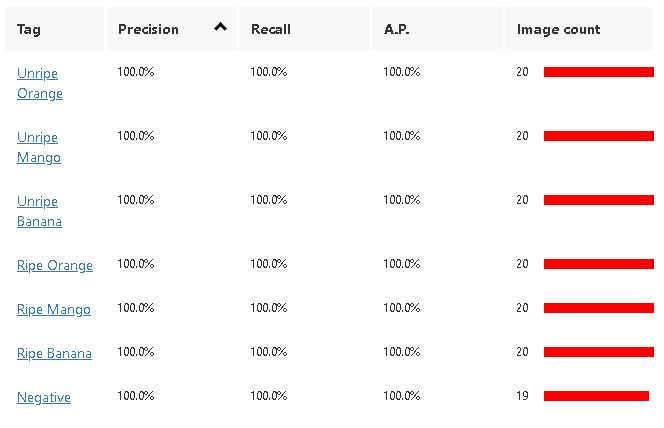

# REPORT: MULTI-FRUIT CLASSIFIER TRAINING

**Student:** Lay Vo Duc
**Student ID:** 104240618
**Tool Used:** Azure Custom Vision

---

## 1. Objective and Core Principles

The objective of this assignment is to train a model that can classify multi-fruits (unripe and ripe).

- **Scope**: This project trains the model on three distinct fruits in two states:
  - **Orange** (Ripe / Unripe)
  - **Mango** (Ripe / Unripe)
  - **Banana** (Ripe / Unripe)

## 2. Methodology & Dataset

- **Dataset Distribution**: I used a balanced dataset consisting of 20 images for each fruit category and 19 images for the Negative background.
- **Total Images**: 139 images were uploaded and tagged within the Azure Custom Vision portal.
- **Training Domain**: The "General" domain was used to ensure a broad understanding of fruit geometry and surface characteristics with probability threshold is 50%.

## 3. Performance Metrics

The model achieved perfect scores during the evaluation phase.

## 4. Critical Analysis & Observations

In alignment with the rubric, I have evaluated the classifier’s performance and its limitations.

### Performance vs. Reality

- **Successes**: The 100% Precision and Recall scores suggest that the current dataset provides very clear, distinguishable features for each tag.
- **Visual Geometry**: Bananas were likely the easiest to classify because of their unique shape, whereas Oranges and Mangos rely more on surface texture and curvature, making it harder to classify.
- **Critical Point**: While the metrics are perfect, it is important to stay critical; such high scores often indicate "overfitting" to a specific background or lighting setup.

## 5. Conclusion & Recommendations

The classifier successfully met the "Exemplary" criteria for training on multiple fruits.

- **Final Assessment**: The model effectively identifies 6 different fruit states plus a negative background with high accuracy.
- **Future Improvement**: I recommend adding more data into negative category to enhance its prediction.image file>
